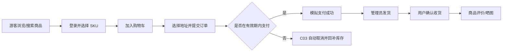
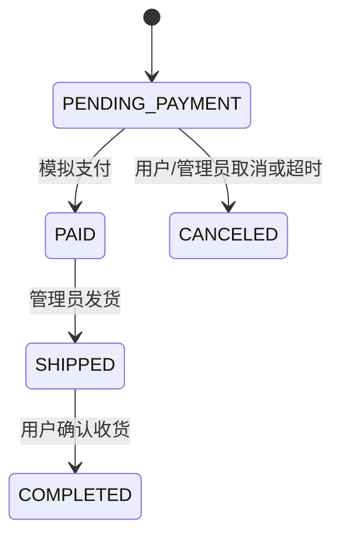

# 电子商城需求规格说明书

> 组别：24 级全栈 2 班第 7 组
>
> 编写人：全组　汇总人：祝意远
>
> 编写日期：2026-07-22　最后修订：2026-07-30　版本：v1.2

## 修订记录

| 版本 | 日期 | 修改人 | 修改说明 |
|------|------|--------|----------|
| v1.0 | 2026-07-22 | 全组 | 确定三端范围、用户角色和核心购物流程 |
| v1.1 | 2026-07-24 | 祝意远 | 补充 SKU、操作日志和 C03 订单超时取消 |
| v1.2 | 2026-07-30 | 祝意远 | 按最终实现补充收藏、评价晒图、浏览历史和运营统计 |

## 一、引言

### 1.1 编写目的

本文档说明 E-Shop 的业务范围、角色、功能和验收条件，供小组成员进行设计、开发、联调、测试和答辩使用。接口实现以 `docs/02-设计文档/接口设计.md` 及冻结文档为准，验收以本需求与教师发布的验收标准为准。

### 1.2 项目背景

本项目是面向课程验收的 B2C 电子商城。系统需要在有限开发周期内提供 PC 消费者端、手机 H5 消费者端和 Web 管理端，并通过同一套后端 API 完成真实数据库上的购物闭环。支付、物流采用课程范围内的模拟实现，不接入真实第三方平台。

### 1.3 项目目标

1. 完成注册登录、商品浏览、购物车、下单、支付、发货、收货的完整闭环。
2. 为管理员提供商品、SKU、分类、订单、用户、评价和库存管理能力。
3. 完成不少于 2 项选做功能及至少 1 项挑战模块。
4. 通过参数校验、权限控制、事务、条件更新和自动化测试保障关键业务正确性。
5. 通过 Docker Compose 提供一致、可重复的本地演示环境。

### 1.4 术语定义

| 术语 | 说明 |
|------|------|
| SKU | 库存量单位，同一商品下可独立定价和管理库存的具体规格 |
| JWT | 登录成功后签发的无状态身份令牌 |
| H5 | 使用浏览器访问、适配手机屏幕的移动 Web 页面，不生成 APK/iOS 安装包 |
| 模拟支付 | 在系统内部生成支付记录并改变订单状态，不连接真实支付渠道 |
| 商品快照 | 下单时在订单项保存商品名、规格、图片和价格，避免后续改价影响历史订单 |
| C03 | 课程挑战模块“订单超时自动取消并回补库存” |

## 二、总体描述

### 2.1 用户角色

| 角色 | 描述 | 主要操作 |
|------|------|----------|
| 游客 | 未登录访问者 | 浏览分类、搜索商品、查看详情、公开评价和热销排行；注册、登录 |
| 会员（买家） | 已注册且状态正常的用户 | 维护资料和地址、收藏、记录浏览历史、加购、下单、支付、取消、确认收货、评价晒图 |
| 管理员 | 具有 `ADMIN` 角色的后台人员 | 管理用户、分类、商品、SKU、订单、评价、库存预警、图片和操作日志；查看运营看板 |

### 2.2 三端范围

| 端 | 定位 | 技术/UI | 主要入口 |
|----|------|---------|----------|
| PC 消费者端 | 桌面浏览器购物 | Vue 3 + Element Plus | `/pc/products` |
| 手机 H5 消费者端 | 手机浏览器购物 | Vue 3 + Vant | `/m/products` |
| Web 管理端 | 运营人员后台 | Vue 3 + Element Plus | `/admin/login` |

三端共用 Spring Boot API 和 MySQL 数据库。手机端为响应式 H5，不属于原生 Android/iOS App、小程序或安装包。

### 2.3 核心业务流程

### 2.4 功能模块清单

| 模块编号 | 模块名称 | 优先级 | 范围 |
|----------|----------|--------|------|
| M01 | 用户与权限 | P0 | 注册、登录、退出、资料、用户启停、JWT |
| M02 | 商品与分类 | P0 | 分类、搜索、列表、详情、后台商品管理 |
| M03 | SKU 与库存 | P0 | 多规格、价格、条件扣减、库存预警 |
| M04 | 购物车与地址 | P0 | 增删改选、金额汇总、地址 CRUD 与默认地址 |
| M05 | 订单与支付 | P0 | 下单、列表、详情、取消、模拟支付、发货、收货 |
| M06 | 三端页面 | P0 | PC、手机 H5、Web 管理端完整业务页面 |
| M07 | 评价与收藏 | P1 | 评价、晒图、审核、评分统计、收藏 |
| M08 | 浏览与运营 | P1 | 浏览历史、热销榜、销售趋势、Top 商品 |
| M09 | 审计与部署 | P1 | 操作日志、文件上传、健康检查、Compose |
| M10 | C03 挑战 | P1 | 超时扫描、条件取消、库存回补和冲突保护 |

## 三、功能需求详述

### 3.1 用户与权限（M01）

#### M01-01 用户注册

- 游客输入用户名、密码和昵称完成注册。
- 用户名必须唯一，密码按规则校验并使用 BCrypt 保存。
- 重复用户名、超长密码或非法字段返回明确的 4xx 业务错误。
- 验收：成功注册后可以登录；数据库中不存在明文密码。

#### M01-02 登录、退出与登录态

- 启用用户凭用户名和密码登录，成功后返回 JWT 和用户信息。
- 前端持久化令牌，并在受保护请求中发送 `Authorization: Bearer`。
- 退出时清理本地登录态；禁用用户不能登录，旧 JWT 也不能继续访问。
- 验收：匿名访问受保护接口返回 401，普通用户访问管理员接口返回 403。

#### M01-03 个人信息与后台用户管理

- 用户可查看和修改昵称、手机号。
- 管理员可分页、检索用户并启用或禁用普通用户。
- 管理员操作写入操作日志。

### 3.2 商品、分类与 SKU（M02/M03）

#### M02-01 商品浏览

- 游客可分页查看已上架商品，按分类和关键词筛选。
- PC 和手机端均提供列表、无结果、加载失败与重试状态。
- 商品详情展示图片、说明、可用 SKU、价格和库存。

#### M02-02 后台分类与商品管理

- 管理员可新增、修改、删除分类和商品，并控制启用/停用、上架/下架。
- 存在上架商品时不能停用或删除关联分类。
- 商品上架前至少存在一个启用 SKU；有未结束订单引用时不能删除商品。

#### M03-01 SKU 与库存

- 每个 SKU 使用唯一编码、规格 JSON、价格、库存和状态。
- 下单使用带库存条件的更新扣减，库存不足时订单创建失败。
- 取消待支付订单或 C03 自动取消时只回补一次库存。
- 后台提供低库存阈值、商品名称和 SKU 编码筛选。

### 3.3 购物车与地址（M04）

#### M04-01 购物车

- 登录用户可加入 SKU、修改数量、选择/取消选择、删除条目。
- 同一 SKU 重复加入时累计数量，总数不超过 99，也不能超过有效库存。
- PC 和手机端展示条目小计、选中合计与购物车角标。

#### M04-02 收货地址

- 用户只能维护自己的地址，支持新增、查看、修改、删除和设置默认地址。
- 设置一个默认地址时自动取消其他默认地址。
- 下单后保存地址快照，后续修改地址不影响历史订单。

### 3.4 订单与支付（M05）

#### M05-01 创建订单

- 用户选择购物车条目和收货地址后提交订单。
- 服务端重新读取 SKU 价格和库存计算总额，不能信任前端金额。
- 创建订单、保存订单项、扣减库存和清理已购买购物车条目在同一事务中完成。

#### M05-02 订单查询与取消

- 用户只可查看自己的订单列表、详情和状态日志。
- 待支付订单可由用户或管理员取消，取消成功后回补库存。
- 已取消、已支付、已发货或已完成订单不能重复取消。

#### M05-03 模拟支付、发货与收货

- 待支付订单可生成唯一支付记录并进入已支付状态。
- 管理员将已支付订单发货；用户将已发货订单确认收货。
- 每次状态变化记录来源状态、目标状态、操作人与说明。

### 3.5 扩展功能（M07/M08/M09）

#### M07-01 收藏、评价与晒图

- 登录用户可收藏/取消商品并查看收藏列表。
- 已完成订单的订单项可以评价一次，评分 1～5 星，内容 1～1000 字。
- 评价可附 0～3 张通过系统上传接口获得的图片地址。
- 详情页显示公开评价和评分分布；管理员可隐藏/恢复评价；用户的“我的评价”保留审核状态。

#### M08-01 浏览历史与运营统计

- 登录用户进入在售商品详情时静默记录浏览历史，同一用户同一商品只保留一条并刷新时间。
- 用户可分页查看、删除单条和清空历史。
- 后台展示用户数、商品数、订单数、销售额、低库存数、近 N 日销售趋势和 Top 商品。
- 消费者端展示基于有效订单统计的热销排行。

#### M09-01 文件、日志和导出

- 图片上传仅允许规定类型和大小，普通用户上传用于评价，管理员上传用于商品。
- 关键后台写操作记录操作人、模块、动作、路径、结果和时间。
- 后台订单支持按筛选条件导出脱敏且防公式注入的 CSV。

### 3.6 挑战模块 C03

- 系统定时扫描超过配置时限仍为 `PENDING_PAYMENT` 的订单。
- 使用“订单 ID + 当前状态”的条件更新竞争取消权，只有更新成功者回补库存。
- 若支付先成功，取消条件不成立；若取消先成功，后续支付返回状态冲突。
- 重复扫描和多实例扫描均不能重复回补库存。
- 默认超时时间 30 分钟，演示时可通过环境变量临时缩短。

## 四、业务规则与状态

### 4.1 订单状态

### 4.2 关键数据规则

1. 商品金额、订单金额和销售统计使用两位小数。
2. 订单项必须保存商品、SKU、图片和成交价快照。
3. 公开商品接口只返回已上架商品，后台接口由管理员权限保护。
4. 评价唯一性由业务校验和 `order_item_id` 唯一索引共同保障。
5. 浏览历史、收藏按“用户 + 商品”唯一，删除操作保持幂等。

## 五、非功能需求

| 类别 | 需求描述 | 验证方式 |
|------|----------|----------|
| 性能 | 列表接口分页；常规本地页面目标 2 秒内可交互 | 浏览器点检、接口响应观察 |
| 安全 | BCrypt、JWT、角色权限、参数校验、禁止 SQL 字符串拼接 | 集成测试与手工越权测试 |
| 一致性 | 订单创建、支付、取消和库存变更满足事务与幂等要求 | 正常/重复/并发边界用例 |
| 兼容 | Chrome、Edge 最新版；手机 H5 常见宽度无明显错位 | 人工兼容测试 |
| 可维护 | 统一响应、统一错误码、业务分包、Flyway 增量迁移 | 代码审查 |
| 可部署 | MySQL、后端、前端可由 Docker Compose 启动 | Compose 配置及真实环境冒烟 |
| 数据 | 至少 30 个商品、3 个分类的演示数据 | Flyway V3 与数据库抽查 |

## 六、界面范围

| 端 | 核心页面 |
|----|----------|
| PC | 登录、商品列表/详情、热销榜、收藏、浏览历史、购物车、地址、结算、支付、订单列表/详情、我的评价、个人资料 |
| 手机 H5 | 登录、商品列表/详情、收藏、浏览历史、购物车、地址、结算、支付、订单列表/详情、评价、个人中心 |
| Web 管理端 | 登录、数据看板、用户、分类、商品/SKU、库存预警、订单、评价审核、操作日志 |

## 七、范围边界

本版本不实现真实第三方支付、真实物流、退款退货、站内消息、优惠券、秒杀、多后端负载均衡和完整商业智能分析。C09 仅完成销售趋势和 Top 商品等部分能力，不作为本组主挑战模块申报。

## 八、需求验收追踪

- 必做功能 F01～F13：13/13 已实现。
- 选做功能：评价晒图、收藏、浏览历史、SKU、操作日志，超过至少 2 项要求。
- 挑战模块：C03 已实现，设计和演示脚本已归档。
- 详细证据见 `docs/03-测试文档/功能完成度对照表-验收用.md` 与 `测试报告.md`。

## 九、确认事项

| 确认人 | 角色 | 日期 | 意见 |
|--------|------|------|------|
| 祝意远 | 组长/架构员 | 2026-07-30 | 已按当前主仓库实现复核 |
| 指导教师 | 指导教师 | 待验收 | 现场确认 |
