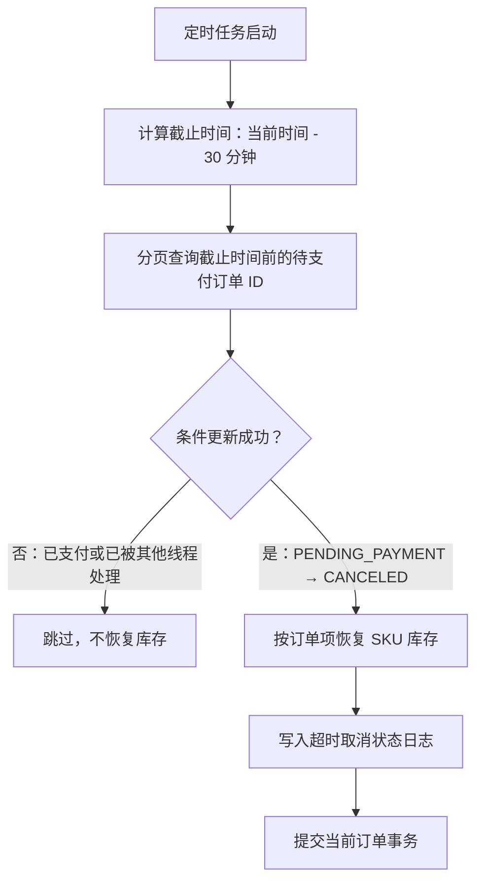

# C03 订单超时自动取消设计

## 1. 验收目标

- 待支付订单创建 30 分钟后仍未支付，系统自动取消。
- 取消成功后恢复全部订单项对应的 SKU 库存。
- 自动取消、用户支付、用户取消和管理员取消同时发生时，订单只能进入一个最终分支。
- 多个后端实例同时扫描同一订单时，库存只能恢复一次。
- 保存订单状态日志，能够说明订单由谁、因为什么原因发生状态变化。

## 2. 实现位置

| 内容 | 文件 |
|---|---|
| 定时扫描器 | `backend/src/main/java/com/eshop/backend/order/OrderTimeoutScheduler.java` |
| 超时配置 | `backend/src/main/java/com/eshop/backend/order/OrderTimeoutProperties.java` |
| 条件取消和库存恢复 | `backend/src/main/java/com/eshop/backend/order/OrderService.java` |
| Docker 配置 | `docker-compose.yml`、`.env.example` |
| 自动化验证 | `BackendEdgeCaseIntegrationTest#expiredOrderIsCanceledOnceAndStockIsRestoredOnce` |

## 3. 执行流程



每个订单使用独立事务处理。一个订单恢复库存失败时只回滚该订单，不影响同批次的其他订单。

## 4. 支付与取消冲突处理

支付与超时取消都使用数据库条件更新：

```sql
-- 支付
UPDATE orders
SET status = 'PAID', paid_at = ?
WHERE id = ?
  AND status = 'PENDING_PAYMENT'
  AND created_at > ?;

-- 超时取消
UPDATE orders
SET status = 'CANCELED', canceled_at = ?
WHERE id = ?
  AND status = 'PENDING_PAYMENT'
  AND created_at <= ?;
```

两个事务竞争同一订单时，数据库只允许其中一个条件更新影响 1 行：

- 支付先成功：取消更新影响 0 行，不恢复库存。
- 取消先成功：支付更新影响 0 行，返回订单状态冲突；取消事务恢复库存。
- 两个后端实例同时取消：只有一个实例更新成功，另一个更新 0 行，因此不会重复恢复库存。
- 订单已超过支付时限但扫描器尚未处理：支付更新受 `created_at` 条件限制并返回 40926，不能利用扫描间隙完成晚付。

这套方案不依赖进程内锁，重启后仍然有效，也可支持多个后端实例。

## 5. 配置

```dotenv
ORDER_TIMEOUT_ENABLED=true
ORDER_TIMEOUT_MINUTES=30
ORDER_TIMEOUT_BATCH_SIZE=100
ORDER_TIMEOUT_INITIAL_DELAY_MS=15000
ORDER_TIMEOUT_SCAN_DELAY_MS=60000
```

- 正式演示默认使用 30 分钟。
- 为了现场快速演示，可临时将 `ORDER_TIMEOUT_MINUTES=1`、`ORDER_TIMEOUT_SCAN_DELAY_MS=5000`，然后重建后端容器。
- 单次扫描最多处理 10 个批次，每批最多 500 个订单，防止一次任务长期占用线程。

## 6. 现场演示步骤

1. 查询某个 SKU 当前库存。
2. 用户购买 2 件并创建订单，不支付。
3. 确认库存减少 2，订单状态为 `PENDING_PAYMENT`。
4. 等待配置的超时时间和一次扫描周期。
5. 刷新订单，确认状态为 `CANCELED`。
6. 再查 SKU，确认库存恢复 2。
7. 查询 `GET /api/orders/{id}/logs`，确认存在“订单支付超时自动取消”日志。
8. 对该订单再次调用支付接口，确认返回 40912。

## 7. 自动化测试结论

自动化测试验证了：

- 超时前不会被查询为过期订单。
- 超时后第一次取消返回成功。
- 同一订单第二次取消返回失败，库存没有重复增加。
- 库存恢复到下单前数值。
- 状态日志记录 `PENDING_PAYMENT → CANCELED`。
- 超时取消后支付被拒绝。
- 超过支付时限、定时扫描尚未执行时，支付也会被拒绝。
- 存在未完成订单时不能删除对应商品，避免 SKU 被删除后无法恢复库存。
- 存在未完成订单时不能删除对应 SKU；订单结束后可安全删除。
