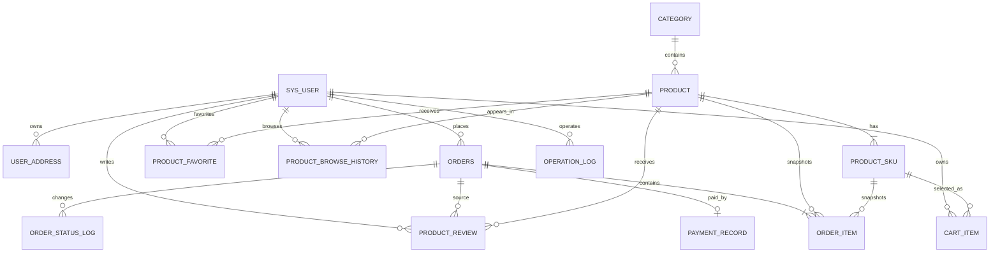

# 数据库设计

> 组别：24 级全栈 2 班第 7 组
>
> 编写人：全组　汇总人：祝意远
>
> 编写日期：2026-07-24　最后修订：2026-07-30　版本：v1.2

## 修订记录

| 版本 | 日期 | 修改人 | 修改说明 |
|------|------|--------|----------|
| v1.0 | 2026-07-24 | 祝意远 | 完成用户、商品、订单等核心表 |
| v1.1 | 2026-07-28 | 全组 | 增加收藏和评价 |
| v1.3 | 2026-07-30 | 祝意远 | 增加卖家角色及账号管理索引并按 V1～V8 校准 |
| v1.2 | 2026-07-30 | 祝意远 | 增加浏览历史、评价晒图并按 V1～V7 校准 |

## 一、设计说明

| 项 | 说明 |
|----|------|
| 数据库 | MySQL 8.4，InnoDB |
| 字符集 | `utf8mb4` / `utf8mb4_unicode_ci` |
| 迁移工具 | Flyway 11，脚本 V1～V8 |
| 命名规范 | 表名、字段名小写下划线；主键统一 `BIGINT id` |
| 时间规范 | 业务时间使用 `DATETIME`，后端和数据库按 Asia/Shanghai 解释 |
| 金额规范 | `DECIMAL(12,2)`，不使用浮点数保存金额 |
| 关联方式 | 课程项目以应用层校验和索引为主，未声明物理外键，便于测试清理与数据迁移 |
| 删除策略 | 业务对象优先状态控制；允许物理删除时由 Service 清理关联数据 |

## 二、ER 图



## 三、表清单

| 序号 | 表名 | 用途 | 迁移 |
|------|------|------|------|
| 1 | `sys_user` | 买家、卖家、平台管理员、密码与启停状态 | V1/V8 |
| 2 | `operation_log` | 后台操作审计 | V1 |
| 3 | `category` | 多级商品分类 | V2 |
| 4 | `product` | SPU 商品信息与上下架状态 | V2 |
| 5 | `product_sku` | 规格、价格和库存 | V2 |
| 6 | `cart_item` | 用户购物车条目 | V2 |
| 7 | `user_address` | 用户收货地址 | V2 |
| 8 | `orders` | 订单主表与地址快照 | V2 |
| 9 | `order_item` | 商品/SKU/成交价快照 | V2 |
| 10 | `order_status_log` | 订单状态变化记录 | V2 |
| 11 | `payment_record` | 模拟支付记录 | V2 |
| 12 | `product_favorite` | 商品收藏 | V4 |
| 13 | `product_review` | 商品评价、评分、晒图和审核状态 | V5/V7 |
| 14 | `product_browse_history` | 最近浏览商品 | V6 |

## 四、核心表结构

### 4.1 用户表 `sys_user`

| 字段 | 类型 | 空 | 默认 | 说明 |
|------|------|----|------|------|
| id | BIGINT | 否 | 自增 | 主键 |
| username | VARCHAR(50) | 否 | - | 登录名，唯一 |
| password_hash | VARCHAR(100) | 否 | - | BCrypt 密文 |
| nickname | VARCHAR(50) | 否 | - | 显示昵称 |
| phone | VARCHAR(20) | 是 | NULL | 联系电话 |
| role | VARCHAR(20) | 否 | USER | `USER`（买家）/ `SELLER`（卖家）/ `ADMIN`（平台管理员） |
| status | VARCHAR(20) | 否 | ENABLED | `ENABLED` / `DISABLED` |
| created_at / updated_at | DATETIME | 否 | 当前时间 | 审计时间 |

索引：用户名唯一索引；`idx_sys_user_status(status)`；V8 新增 `idx_sys_user_role_status(role, status)`，支持平台管理页按角色和状态组合筛选。

### 4.2 操作日志表 `operation_log`

| 字段 | 类型 | 说明 |
|------|------|------|
| id | BIGINT | 主键 |
| operator_id / operator_name | BIGINT / VARCHAR(50) | 操作人快照，可空 |
| module / action | VARCHAR(50) | 业务模块和动作 |
| request_uri | VARCHAR(255) | 请求地址 |
| success | TINYINT(1) | 是否成功 |
| message | VARCHAR(255) | 结果说明 |
| created_at | DATETIME | 操作时间 |

索引：创建时间、操作人。

### 4.3 分类表 `category`

| 字段 | 类型 | 说明 |
|------|------|------|
| id | BIGINT | 主键 |
| parent_id | BIGINT | 父分类；根分类为空 |
| name | VARCHAR(50) | 分类名 |
| sort_order | INT | 排序值 |
| status | VARCHAR(20) | `ENABLED` / `DISABLED` |
| created_at / updated_at | DATETIME | 审计时间 |

索引：`(parent_id, sort_order)`、`status`。应用层阻止循环父子关系以及非法停用。

### 4.4 商品表 `product`

| 字段 | 类型 | 说明 |
|------|------|------|
| id | BIGINT | 主键 |
| category_id | BIGINT | 分类 ID |
| name | VARCHAR(120) | 商品名称 |
| subtitle | VARCHAR(255) | 副标题 |
| main_image | VARCHAR(500) | 主图 URL |
| detail | TEXT | 详情 |
| status | VARCHAR(20) | `DRAFT` / `ON_SALE` / `OFF_SALE` |
| created_at / updated_at | DATETIME | 审计时间 |

索引：`(category_id, status)`、创建时间。

### 4.5 SKU 表 `product_sku`

| 字段 | 类型 | 说明 |
|------|------|------|
| id | BIGINT | 主键 |
| product_id | BIGINT | 所属商品 |
| sku_code | VARCHAR(64) | 唯一 SKU 编码 |
| specs_json | VARCHAR(1000) | 如 `{"颜色":"黑","容量":"128GB"}` |
| price | DECIMAL(12,2) | 售价 |
| stock | INT | 当前库存，不允许负数 |
| status | VARCHAR(20) | `ENABLED` / `DISABLED` |
| created_at / updated_at | DATETIME | 审计时间 |

索引：SKU 编码唯一；`(product_id, status)`。库存扣减使用 `stock >= quantity` 条件更新。

### 4.6 购物车表 `cart_item`

| 字段 | 类型 | 说明 |
|------|------|------|
| id | BIGINT | 主键 |
| user_id / sku_id | BIGINT | 用户与 SKU |
| quantity | INT | 数量，业务范围 1～99 |
| selected | TINYINT(1) | 是否选中结算 |
| created_at / updated_at | DATETIME | 审计时间 |

唯一键：`uk_cart_user_sku(user_id, sku_id)`，同一 SKU 重复加购时累计数量。

### 4.7 地址表 `user_address`

| 字段 | 类型 | 说明 |
|------|------|------|
| id / user_id | BIGINT | 主键、所属用户 |
| receiver_name | VARCHAR(50) | 收货人 |
| phone | VARCHAR(20) | 联系电话 |
| province / city / district | VARCHAR(50) | 省市区 |
| detail | VARCHAR(255) | 详细地址 |
| is_default | TINYINT(1) | 是否默认 |
| created_at / updated_at | DATETIME | 审计时间 |

索引：`(user_id, is_default)`。默认地址唯一性由事务内先清除再设置保证。

### 4.8 订单主表 `orders`

| 字段 | 类型 | 说明 |
|------|------|------|
| id | BIGINT | 主键 |
| order_no | VARCHAR(32) | 唯一订单号 |
| user_id | BIGINT | 下单用户 |
| total_amount | DECIMAL(12,2) | 服务端计算总额 |
| status | VARCHAR(30) | 订单状态 |
| receiver_name / receiver_phone | VARCHAR | 收货人快照 |
| receiver_address | VARCHAR(500) | 完整地址快照 |
| remark | VARCHAR(255) | 用户备注 |
| paid_at / shipped_at / completed_at / canceled_at | DATETIME | 各状态时间 |
| created_at / updated_at | DATETIME | 审计时间 |

订单状态：

| 状态 | 含义 | 允许下一状态 |
|------|------|--------------|
| `PENDING_PAYMENT` | 待支付 | `PAID`、`CANCELED` |
| `PAID` | 已支付 | `SHIPPED` |
| `SHIPPED` | 已发货 | `COMPLETED` |
| `COMPLETED` | 已完成 | 终态 |
| `CANCELED` | 已取消 | 终态 |

索引：订单号唯一；`(user_id, created_at)`；`(status, created_at)`，后者也支持 C03 扫描。

### 4.9 订单项表 `order_item`

| 字段 | 类型 | 说明 |
|------|------|------|
| id / order_id | BIGINT | 主键、所属订单 |
| product_id / sku_id | BIGINT | 原商品和 SKU 标识 |
| product_name | VARCHAR(120) | 下单时商品名快照 |
| sku_specs | VARCHAR(1000) | 规格快照 |
| product_image | VARCHAR(500) | 图片快照 |
| price | DECIMAL(12,2) | 成交单价 |
| quantity | INT | 数量 |
| subtotal | DECIMAL(12,2) | 小计 |
| created_at | DATETIME | 创建时间 |

订单项冗余展示数据是为了保证商品改名、改图、改价或下架后历史订单仍可正确展示和对账。

### 4.10 状态日志表 `order_status_log`

| 字段 | 类型 | 说明 |
|------|------|------|
| id / order_id | BIGINT | 主键、订单 |
| from_status / to_status | VARCHAR(30) | 前后状态 |
| operator_id / operator_name | BIGINT / VARCHAR(50) | 操作人，可为空 |
| remark | VARCHAR(255) | 支付、发货、取消或超时说明 |
| created_at | DATETIME | 状态变化时间 |

索引：`(order_id, created_at)`。

### 4.11 支付记录表 `payment_record`

| 字段 | 类型 | 说明 |
|------|------|------|
| id | BIGINT | 主键 |
| payment_no | VARCHAR(32) | 唯一支付号 |
| order_id | BIGINT | 订单，一单一支付记录，唯一 |
| order_no / user_id | VARCHAR(32) / BIGINT | 查询快照 |
| amount | DECIMAL(12,2) | 支付金额 |
| status | VARCHAR(20) | 支付状态 |
| paid_at | DATETIME | 支付成功时间 |
| created_at / updated_at | DATETIME | 审计时间 |

`order_id` 和 `payment_no` 的唯一约束共同避免重复模拟支付记录。

## 五、扩展表结构

### 5.1 收藏表 `product_favorite`

| 字段 | 类型 | 说明 |
|------|------|------|
| id | BIGINT | 主键 |
| user_id / product_id | BIGINT | 用户与商品 |
| created_at | DATETIME | 收藏时间 |

唯一键：`(user_id, product_id)`；索引支持用户时间倒序和商品反查。

### 5.2 评价表 `product_review`

| 字段 | 类型 | 说明 |
|------|------|------|
| id | BIGINT | 主键 |
| user_id / product_id | BIGINT | 评价用户与商品 |
| order_id / order_item_id | BIGINT | 来源订单和订单项 |
| rating | TINYINT | 1～5 星，数据库 CHECK |
| content | VARCHAR(1000) | 评价正文 |
| images_json | VARCHAR(2000) | 0～3 个 `/api/uploads/` URL 的 JSON 数组 |
| status | VARCHAR(20) | `PUBLISHED` / `HIDDEN` |
| created_at / updated_at | DATETIME | 审计时间 |

唯一键：`order_item_id`，保证一个订单项只评价一次；索引支持商品公开评价和用户“我的评价”。

### 5.3 浏览历史表 `product_browse_history`

| 字段 | 类型 | 说明 |
|------|------|------|
| id | BIGINT | 主键 |
| user_id / product_id | BIGINT | 用户与商品 |
| browsed_at | DATETIME | 最近浏览时间 |

唯一键：`(user_id, product_id)`。重复浏览不新增记录，只更新 `browsed_at`；索引 `(user_id, browsed_at)` 支持最近访问分页。

## 六、关键一致性设计

### 6.1 下单事务

1. 校验地址归属、购物车选中项、商品和 SKU 状态。
2. 服务端读取价格并计算订单总额。
3. 逐 SKU 执行带库存下限的条件扣减。
4. 写订单、订单项快照和状态日志。
5. 删除已结算购物车项；任一步失败则整体回滚。

### 6.2 取消与 C03

取消先执行：

```sql
UPDATE orders
SET status = 'CANCELED', canceled_at = NOW()
WHERE id = ? AND status = 'PENDING_PAYMENT';
```

只有受影响行数为 1 的执行者才回补库存和写状态日志。支付也通过状态条件更新竞争，因此“支付与超时取消同一瞬间发生”时只有一个状态转换成功。

### 6.3 删除和状态约束

- 上架商品必须有启用 SKU。
- 含上架商品的分类不能停用或删除。
- 存在未结束订单引用的商品不能删除。
- 公开评价和评分统计只使用 `PUBLISHED`。
- 统计销售额只使用 `PAID/SHIPPED/COMPLETED` 订单。

## 七、迁移与初始化

| 版本 | 文件 | 内容 |
|------|------|------|
| V1 | `V1__create_core_tables.sql` | 用户、操作日志 |
| V2 | `V2__create_commerce_tables.sql` | 分类、商品、SKU、购物车、地址、订单、支付 |
| V3 | `V3__seed_demo_catalog.sql` | 3 分类、30 商品及对应 SKU |
| V4 | `V4__create_product_favorite.sql` | 收藏 |
| V5 | `V5__create_product_review.sql` | 评价 |
| V6 | `V6__create_product_browse_history.sql` | 浏览历史 |
| V7 | `V7__add_review_images.sql` | 评价晒图字段 |
| V8 | `V8__index_user_role_status.sql` | 买家/卖家角色与状态联合索引 |

迁移脚本位置：`eshop-release-v1.0/backend/src/main/resources/db/migration/`。已执行脚本禁止改写，所有结构变更必须追加新版本。H2 自动化测试结构同步维护在 `backend/src/test/resources/schema-test.sql`。

## 八、备份、隐私与演示数据

- 演示数据库使用 Docker 命名卷 `mysql_data`。
- 本地 `.env`、数据库卷和上传目录不提交 Git。
- 用户密码仅保存 BCrypt 密文。
- 后台订单 CSV 对手机号和地址脱敏，并防止表格公式注入。
- V3 的演示商品不依赖外部图片服务，便于离线演示。

## 九、验证状态

- V1～V8 已在真实 MySQL 8.4 环境完成迁移验证，`flyway_schema_history` 全部成功。
- V6/V7 对应业务已通过 H2 集成测试、前端生产构建和真实 MySQL API 冒烟。
- 2026-07-30 最终回归共 122 个 API 检查点通过，测试数据已自动清理。
