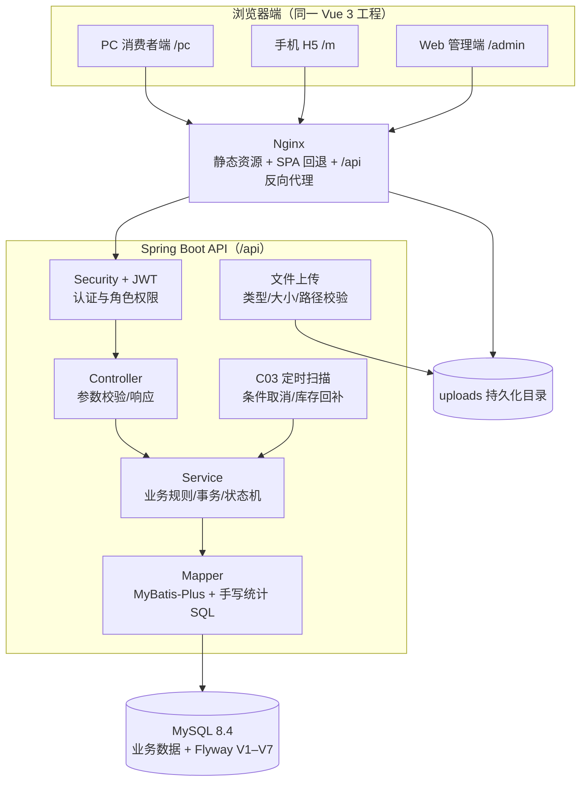
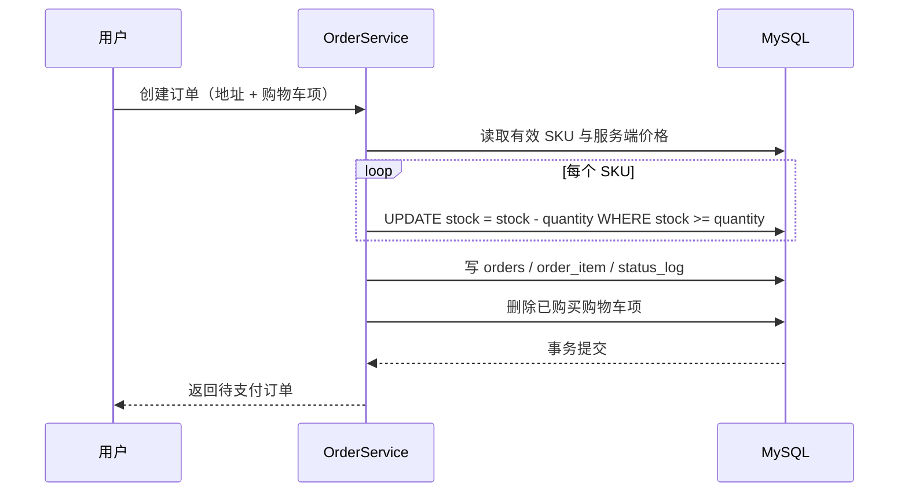
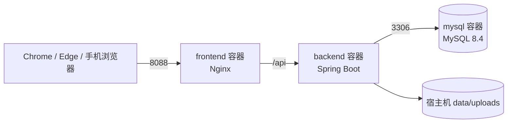

# 系统架构设计

> 组别：24 级全栈 2 班第 7 组
>
> 编写人：全组　汇总人：祝意远
>
> 编写日期：2026-07-24　最后修订：2026-07-30　版本：v1.2

## 修订记录

| 版本 | 日期 | 修改人 | 修改说明 |
|------|------|--------|----------|
| v1.0 | 2026-07-24 | 祝意远 | 确定前后端分离、三端共用 API 与部署结构 |
| v1.1 | 2026-07-28 | 祝意远 | 补充评价、收藏、统计和 C03 |
| v1.2 | 2026-07-30 | 祝意远 | 按最终源码补充浏览历史、晒图、测试与安全设计 |

## 一、设计目标

1. 用一套后端和数据库支撑 PC、手机 H5、Web 管理端，避免重复业务逻辑。
2. 在三周左右的开发周期内优先保证可运行、可测试、可演示。
3. 通过业务分包、统一返回、统一鉴权和接口冻结减少多人协作返工。
4. 对订单、支付、库存等关键写操作使用事务、状态机和条件更新保证一致性。
5. 使用 Docker Compose 降低环境差异，使用 Flyway 保证数据库结构可追踪。

## 二、技术选型及理由

| 分层 | 选型 | 版本 | 选型理由 |
|------|------|------|----------|
| 前端框架 | Vue 3 + Vite | Vue 3.5 / Vite 6 | 组件化开发速度快；一套工程可承载三套路由；Vite 构建和热更新适合短周期项目 |
| 路由与状态 | Vue Router + Pinia | Router 4.5 / Pinia 3 | 支持三端路由分组、权限守卫和轻量登录态管理 |
| PC/后台 UI | Element Plus | 2.9 | 表单、表格、分页和后台组件完整，可减少重复 UI 开发 |
| 手机 H5 UI | Vant | 4.9 | 专为移动 Web 设计，适合手机购物页，不要求开发原生 APK/iOS |
| HTTP 客户端 | Axios | 1.8 | 统一附加 JWT、解包响应和处理 401/403 |
| 后端框架 | Spring Boot | 3.5.16 | Web、校验、安全、事务、健康检查生态完整，适合分层 REST API |
| 鉴权 | Spring Security + JWT + BCrypt | JJWT 0.12.6 | 无状态 JWT 适合三端共享；BCrypt 避免明文密码；角色权限可集中控制 |
| 持久层 | MyBatis-Plus | 3.5.16 | 保留 SQL 可控性，同时减少常规 CRUD 样板代码 |
| 数据库迁移 | Flyway | 11.20.3 | V1～V7 顺序迁移，组员共享数据库结构，避免手工改表遗漏 |
| 数据库 | MySQL | 8.4 | 满足关系型数据、事务、唯一约束、条件更新和统计 SQL 需求 |
| 测试 | JUnit 5 + MockMvc + H2 | Spring Boot Test | 快速覆盖接口、权限和边界；Docker/MySQL 冒烟补足数据库差异 |
| 部署 | Docker Compose + Nginx | Compose v2+ | 一条命令启动数据库、后端和前端；Nginx 同源代理 `/api` 并支持 SPA 刷新 |

未引入 Redis、消息队列、搜索引擎或大型图表库。当前规模下 MySQL 条件更新、定时扫描和轻量 CSS 图表即可满足验收，避免在短周期内增加运维和联调成本。

## 三、总体架构



### 3.1 请求路径

1. 用户访问 `http://localhost:8088`，Nginx 将根路径重定向至 `/pc`。
2. Vue Router 根据 `/pc`、`/m`、`/admin` 加载对应布局和页面。
3. Axios 统一请求相对地址 `/api/**`；Nginx 转发到后端 8080 端口。
4. Spring Security 验证 JWT 和角色，Controller 校验参数，Service 执行业务，Mapper 访问 MySQL。
5. 后端以统一 `ApiResponse` 返回，前端统一处理成功数据和业务错误。

## 四、前端架构

### 4.1 三端路由

```text
frontend/src/
├── api/          # 按 auth、catalog、cart、order、review 等封装请求
├── components/   # 评价、热销、评分等可复用组件
├── layouts/      # PcShopLayout、MobileShopLayout、AdminLayout
├── router/       # 三端路由、登录和角色守卫
├── stores/       # Pinia 登录态
├── utils/        # 购物车角标等跨页面通知
└── views/
    ├── pc/
    ├── mobile/
    └── admin/
```

PC 和手机端共享 API 及业务响应模型，但使用不同页面和 UI 组件；管理端路由要求管理员角色。页面通过按需动态导入拆分构建产物。

### 4.2 公共通信规则

- Axios 请求拦截器附加 JWT。
- 响应拦截器解包统一响应；401 清理无效登录态并回登录页。
- 页面必须处理加载中、空数据、接口错误和防重复提交。
- 不允许后端失败后自动切换 Mock 数据，避免演示时掩盖真实故障。

## 五、后端架构

### 5.1 分层与业务包

```text
com.eshop.backend
├── common/       # 统一响应、错误码、异常处理、分页
├── security/     # JWT、Spring Security、认证异常
├── auth/ user/   # 用户、登录和后台用户
├── catalog/      # 分类、商品、SKU
├── cart/ address/
├── order/        # 订单、支付、状态日志、C03
├── favorite/ browse/ review/
├── analytics/    # 热销排行
├── admin/        # 看板、库存、操作日志
└── file/         # 管理员/普通用户上传入口
```

- Controller：只负责路由、参数校验、当前用户和权限边界。
- Service：负责业务规则、事务、状态流转和 DTO 组装。
- Mapper：负责 CRUD、条件更新、分页与统计 SQL。
- 全局异常处理：把校验、鉴权和业务异常转换为统一 4xx/5xx 响应。

### 5.2 权限矩阵

| 资源 | 游客 | 登录用户 | 管理员 |
|------|------|----------|--------|
| 注册、登录、商品/分类、公开评价、健康检查 | 允许 | 允许 | 允许 |
| 购物车、地址、订单、收藏、浏览历史、我的评价、用户上传 | 401 | 允许本人数据 | 允许自身消费者数据 |
| `/admin/**` | 401 | 403 | 允许 |

后端是权限最终边界，不能只依赖前端隐藏菜单。禁用用户在每次 JWT 认证时重新校验状态。

## 六、关键设计决策

| 决策点 | 当前方案 | 备选方案 | 选择理由 |
|--------|----------|----------|----------|
| 登录鉴权 | 无状态 JWT | Session | 三端共享、部署简单；不依赖服务端会话 |
| 密码存储 | BCrypt | 明文/普通哈希 | 自带随机盐并降低撞库风险 |
| SKU | 商品与 SKU 分表 | 商品表直接存价格库存 | 支持颜色/容量等规格独立价格和库存 |
| 订单金额 | 后端按 SKU 重算并保存快照 | 使用前端金额 | 防篡改，历史订单不受商品改价影响 |
| 库存扣减 | SQL 条件更新 + 事务 | 先查后改 | 避免并发下单产生负库存 |
| 支付/取消冲突 | 订单状态条件更新 | 只在 Java 中判断 | 数据库层竞争唯一状态转换，避免重复回补 |
| C03 | 定时批量扫描 | 每单独立延迟消息 | 项目规模小、无需消息队列、易演示与维护 |
| 图片存储 | 本地持久化目录 + URL | 对象存储/Base64 | 开发和演示环境简单，数据库只保存地址 |
| 评价图片 | JSON URL 数组，最多 3 张 | 单独图片表 | 图片数量固定且只随评价读取，迁移和实现成本低 |
| 浏览历史 | 用户+商品唯一，重复浏览更新时间 | 每次新增记录 | 控制数据量并满足“最近浏览”需求 |
| 数据库演进 | Flyway 只增不改 | 手工 SQL | 保证组员环境和 Docker 环境版本一致 |
| 统计看板 | 手写聚合 SQL | 引入 BI/ES | 数据量小，SQL 可在答辩中逐句说明 |

## 七、订单与库存一致性



取消与超时任务使用状态条件更新取得处理权，再回补每个订单项库存。同一订单只有一个执行者能把 `PENDING_PAYMENT` 改为 `CANCELED`，因此重复任务不会重复回补。

## 八、数据库和文件

- MySQL 使用 `utf8mb4`，核心迁移为 V1～V7。
- `V3` 提供 3 类、30 个演示商品及 SKU。
- 上传文件由后端校验后写入 `data/uploads`，容器中挂载到 `/app/uploads`。
- 数据库不保存图片二进制，只保存 `/api/uploads/**` 地址。
- `.env`、数据库卷、上传数据、依赖目录和构建产物不提交 Git。

## 九、部署架构



| 环境 | 用途 | 说明 |
|------|------|------|
| 本地开发 | 分模块编码 | 前端 Vite，后端 Maven，MySQL 本机或容器 |
| 自动测试 | 快速回归 | H2 + MockMvc；前端执行生产构建 |
| 演示环境 | 完整验收 | `docker compose up -d --build`，入口端口默认 8088 |

当前 Compose 为单后端实例，未申报 C10 负载均衡挑战。

## 十、可观测与质量保障

1. Actuator 仅公开健康检查。
2. 后台重要写操作由 AOP 记录操作日志。
3. JUnit/MockMvc 覆盖权限、状态机、收藏、评价、浏览历史、库存预警和看板。
4. API 冒烟脚本覆盖真实 MySQL 主交易链并清理测试数据。
5. 前端每次集成执行 `npm run build`，提交前扫描冲突标记与敏感文件。

## 十一、代码与协作规范

- Java 类名使用 PascalCase，变量/方法 camelCase，表和字段 snake_case。
- Vue 页面按端放入 `views/pc`、`views/mobile`、`views/admin`；请求集中在 `api`。
- 接口先冻结再开发；新增字段保持向后兼容。
- Git 提交使用 `feat/fix/docs/test/chore` 前缀；业务文件精简交付，禁止整仓覆盖。
- `router/index.js`、公共 HTTP 封装、Flyway 迁移和安全配置由组长统一集成。

## 十二、已知边界

- 支付、物流仅模拟；未连接外部服务。
- 上传文件保存在本机，适合课程演示，不具备对象存储高可用能力。
- C09 只实现摘要、近 N 日趋势和 Top 商品，不宣称完整复购率/分类占比。
- 验收前仍需在 Docker Desktop 启动后执行 V6/V7 的真实 MySQL 最终回归。
