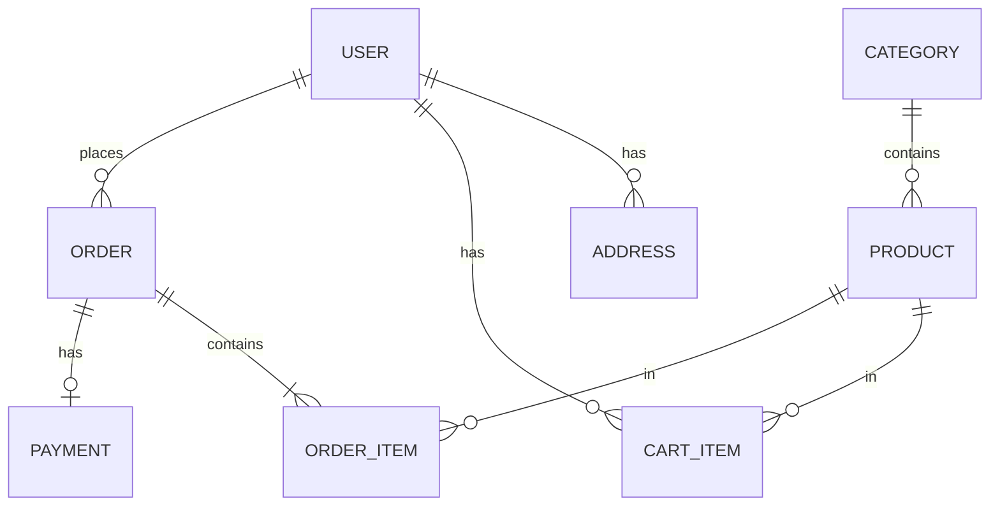

# 数据库设计

> 组别：____ 编写人：____ 编写日期：____ 版本：v1.0
> 截止：第 1 周周五

## 修订记录

| 版本 | 日期 | 修改人 | 修改说明 |
|------|------|--------|----------|
| v1.1 | 2026-07-30 | 祝意远 | 按当前实现补充角色与迁移说明 |
| v1.0 |      |        | 初稿 |

## 一、设计说明

- 数据库类型/版本：
- 字符集：建议 utf8mb4
- 命名规范：表名小写下划线（如 `order_item`），主键统一 `id`，均含 `created_at` / `updated_at`

## 二、ER 图

（用 Mermaid 或图片描述核心实体关系：用户、地址、分类、商品、购物车、订单、订单项、支付记录）

## 三、表结构设计

> 每张表按以下格式编写。参考表数量：8~12 张。

### 3.1 用户表（user）

| 字段名 | 类型 | 允许空 | 默认值 | 说明 |
|--------|------|--------|--------|------|
| id | BIGINT | 否 | 自增 | 主键 |
| username | VARCHAR(50) | 否 | | 用户名，唯一 |
| password | VARCHAR(100) | 否 | | 加密后的密码 |
| phone | VARCHAR(20) | 是 | | 手机号 |
| role | VARCHAR(20) | 否 | USER | `USER` 买家 / `SELLER` 卖家 / `ADMIN` 平台管理员 |
| status | TINYINT | 否 | 1 | 1正常 0禁用 |
| created_at | DATETIME | 否 | 当前时间 | 创建时间 |
| updated_at | DATETIME | 否 | 当前时间 | 更新时间 |

索引：`uk_username(username)` 唯一索引、`idx_sys_user_status(status)`、`idx_sys_user_role_status(role, status)`。

### 3.2 商品分类表（category）
（同上格式…）

### 3.3 商品表（product）

### 3.4 收货地址表（address）

### 3.5 购物车表（cart_item）

### 3.6 订单表（order）

> 提示：订单状态建议字段 `status`：待支付/已支付/已发货/已完成/已取消，在此写明状态码含义。

### 3.7 订单项表（order_item）

> 提示：订单项须冗余下单时的商品名称与价格快照，思考为什么。

### 3.8 支付记录表（payment）

## 四、初始化脚本

- 数据库迁移脚本存放位置：`backend/src/main/resources/db/migration/`，新变更按 `V2__说明.sql`、`V3__说明.sql` 顺序新增；禁止修改已经执行过的迁移脚本。
- 演示数据迁移：`backend/src/main/resources/db/migration/V3__seed_demo_catalog.sql`，包含 3 个分类、30 个已上架商品及对应 SKU。
- 演示商品图片为后端本地静态资源，位于 `backend/src/main/resources/static/demo/`，不依赖外部图片服务。

当前迁移共 V1～V8：V1/V2 创建核心商城表，V3 初始化演示商品，V4 收藏，V5 评价，V6 浏览历史，V7 评价晒图，V8 增加用户角色与状态联合索引。卖家角色复用 `sys_user.role`，不增加重复账号表。
